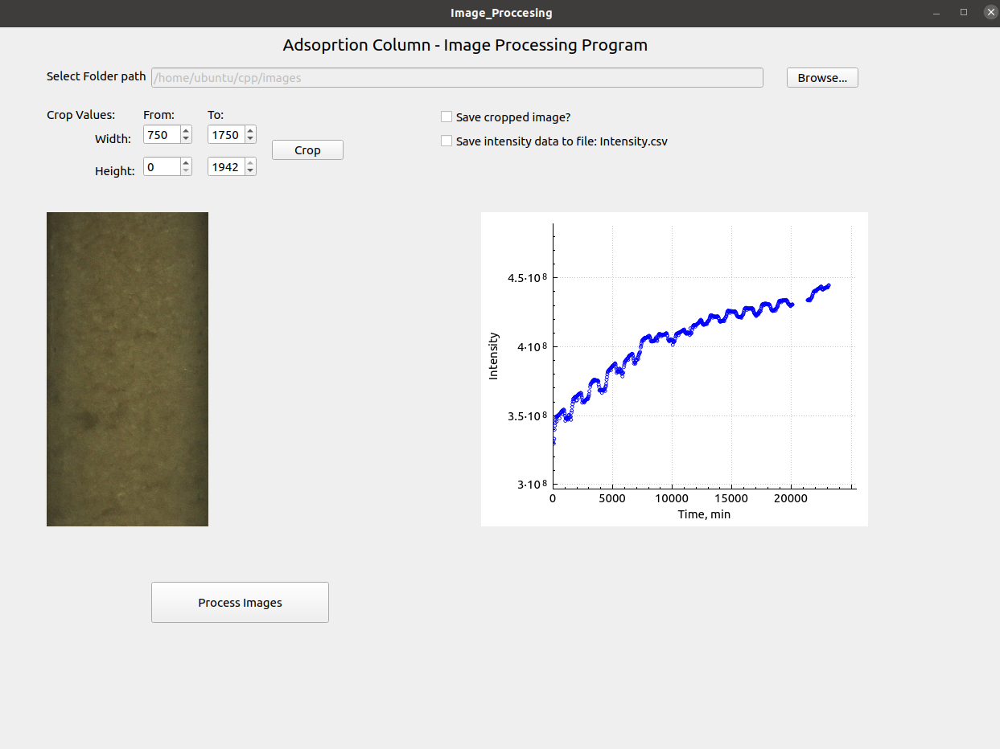

# Image Processing Algorithm for Ion Exchange Column Testing

## Introduction

This Capstone project for the Udacity C++ Nanodegree program focused on determining the pixel brightness intensity of an image to determine the amount of oil trapped in an oil adsorbent resin. As the oil gets deposited on the resin, the resin becomes darker.

The user interface was developed using QT creator. First the user needs to select a folder containing the images to be processed, then the user needs to input the crop region and cropped the picture to the desired frame. Each picture has the relative acquisition time (in seconds) appended at the end of the filename.

When the user clicks the process image button, every image in the folder is cropped to the specified region, then converted to black and white and then the intensity of the image is calculated pixel by pixel, according to the following formula:

    intensity = 255 - pixel brightness

The intensity of each pixel is added together to determine the overall intensity of the image. The intensity of each image is plotted in the user interface. The user interface has the option to save the cropped image in a new folder (“cropped”) within the image folder; and it also allows saving the intensity of each image on a file: intensity.csv located in the same folder as the images.

The image below shows the graphical user interface.

## File Structure

* **image/** contains sample input images that can be used for the program
* **src/*** contains the source files and headers as well as the user interface: Image_adjustment.h, Image_adjustment.cpp, image_processing.h, image_processing.h, image_processing.ui, main.cpp
* **screenshots/** contains screenshots of the GUI
* **CMakeLists.txt** cmake configuration file
* **Readme.md** this file

## Dependencies for Running Locally
* cmake >= 3.7
  * All OSes: [click here for installation instructions](https://cmake.org/install/)
* make >= 4.1 (Linux, Mac), 3.81 (Windows)
  * Linux: make is installed by default on most Linux distros
  * Mac: [install Xcode command line tools to get make](https://developer.apple.com/xcode/features/)
  * Windows: [Click here for installation instructions](http://gnuwin32.sourceforge.net/packages/make.htm)
* SDL2 >= 2.0
  * All installation instructions can be found [here](https://wiki.libsdl.org/Installation)
  >Note that for Linux, an `apt` or `apt-get` installation is preferred to building from source. 
* gcc/g++ >= 9.3
  * Linux: gcc / g++ is installed by default on most Linux distros
  * Mac: same deal as make - install Xcode command line tools
  * Windows: recommend using MinGW
  >Note: In Ubuntu, gcc and g++ version 9 can be installed and set as default with the following commands:
  > * `sudo apt install gcc-9 g++-9`
  > * `sudo update-alternatives --install /usr/bin/gcc gcc /usr/bin/gcc-9 90 --slave /usr/bin/g++ g++ /usr/bin/g++-9 --slave /usr/bin/gcov gcov /usr/bin/gcov-9`
* QTcore5
  * QTcore5 can be installed following the instructions in the QT website: https://doc.qt.io/qt-5/build-sources.html
  >Note: In Ubuntu, it can be installed with the following command: `sudo apt install qt5-default`
* Qcustomplot
  * Source: https://github.com/dbzhang800/QCustomPlot
  >Note In Ubuntu, it can be installed with the following command: `sudo apt install libqcustomplot-dev`
        
  >Due to recent updates in QT, the Qcustomplot header files needs to be updated. THe file can be updated by opening the Qcustomplot.h header file located at `/usr/include/qcustomplot.h` and line 91 should be updated from 
  >`#include <QtPrintSupport>` to `#include <QtPrintSupport/QtPrintSupport>`        
* OpenCV >= 4.1
  * The OpenCV source code can be found here: https://github.com/opencv/opencv
  >Note: In Ubuntu, it can be installed by running: `sudo apt install libopencv-dev`

## Basic Build Instructions

* Clone this repo.
* Make a build directory in the top level directory: mkdir build && cd build
* Compile: cmake .. && make
* Run it: ./image_processing

**Note: This project has been tested in Ubuntu 20.04 LTS and in Ubuntu 16.04 LTS (Udacity Worksapce)**

## Rubric points

Below are the rubric points implemented in this projects.

### Loops, Functions, I/O
* The project demonstrates an understanding of C++ functions and control structures: *image_adjustments.cpp and image_processing.cpp*
* The project reads data from a file and process the data, or the program writes data to a file: *image_adjustments.cpp and image_processing.cpp*
* The project accepts user input and processes the input: *QT interface: image_processing.ui*

###  Object Oriented Programming
* The project uses Object Oriented Programming techniques: *image_adjustments.cpp and image_processing.cpp*
* Class constructors utilize member initialization lists: *image_adjustments.cpp*

### Memory Management
* The project makes use of references in function declarations: *image_processing.cpp - lines 117 and 158*
* The project uses destructors appropriately: *Image_adjustments.cpp - Lines 12 - 23*
* The project follows the Rule of 5: *image_adjustments.cpp*

### Concurrency
* The project uses multithreading: *image_processing.cpp - lines 110- 122*
* A mutex or lock is used in the project: *image_processing.cpp - line 171*

